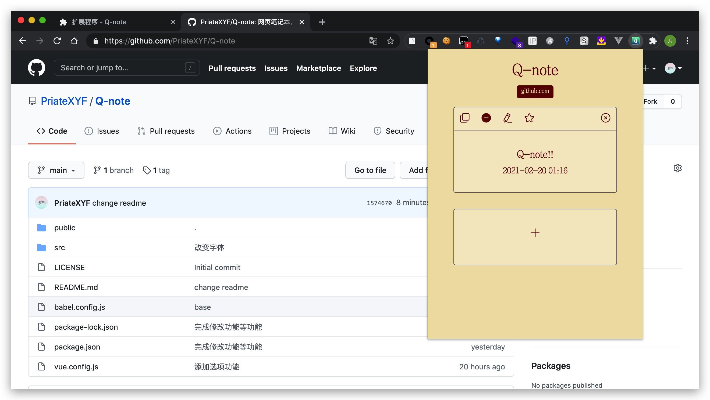
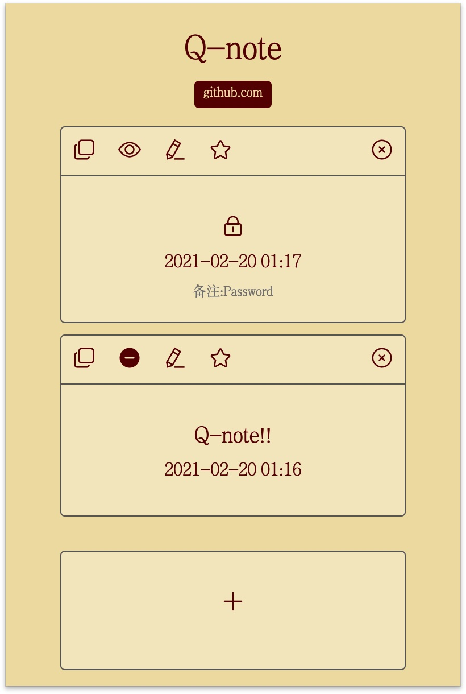
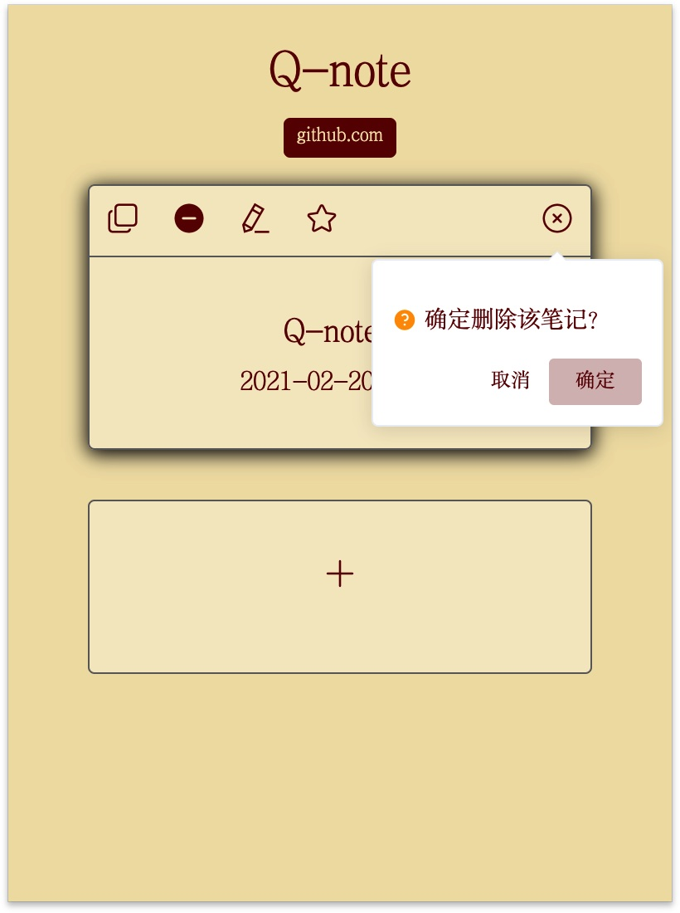
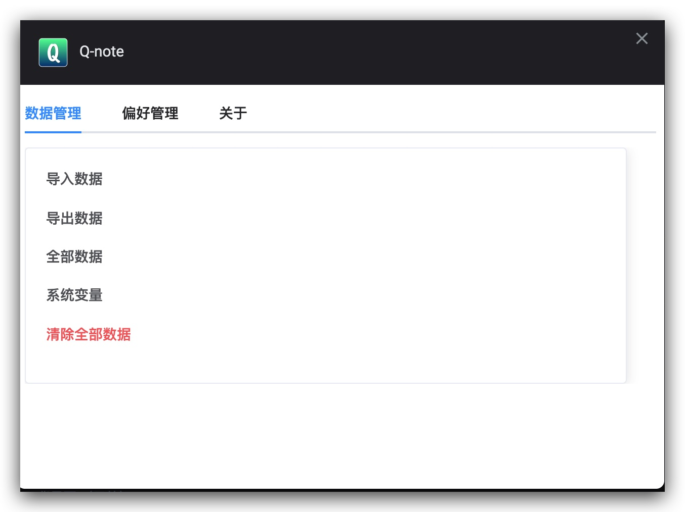

# Q-note

> 一个超级方便的浏览器拓展笔记本，自动通过域名分类。

## 安装

> 由于没有能支付 google pay 的银行卡，无法注册开发者账号上架到Chrome网上应用店，因此安装起来稍微有些麻烦。

---

> 请注意如果需要更新请务必前往拓展程序**导出数据** `选项 -> 数据管理 -> 导出数据` 后重新安装，再导入数据，否则会丢失数据！

---

> 安装完成后请**不要更改文件夹路径或修改文件内容**，否则扩展程序将失效。

### 手动安装

```bash
git clone 'git@github.com:PriateXYF/Q-note.git'
cd Q-note
npm install
npm run build
```

1. 打开 [chrome://extensions/](chrome://extensions/)
2. 开启右上角开发者模式
3. 点击左上角按钮加载已解压的扩展程序，选取之前命令生成的 `dist` 文件夹。
4. 此时已出现拓展程序图标，在图标上点击右键选择 `选项 -> 偏好设置 -> 激活快捷键` 或直接访问 [chrome://extensions/shortcuts](chrome://extensions/shortcuts) ，设置合适的唤起快捷键即可快速唤起弹出框。推荐设置为 `CMD + N`
5. Enjoy it!

### 直接下载

1. 前往 [releases](https://github.com/PriateXYF/Q-note/releases) 下载最新版本的 Q-note.crx 文件。
2. 将 `.crx` 改为 `.rar` 并解压得到拓展程序文件夹。
3. 后续步骤参考手动安装。
4. Enjoy it!


## 快捷键

* `CMD/ALT/WIN + enter` ： 在添加笔记输入框输入完毕时直接添加。
* `CMD/ALT/WIN + n` ： 添加笔记。
* `esc` ： 取消笔记的添加/关闭popup。
* 建议打开 [chrome://extensions/shortcuts](chrome://extensions/shortcuts) 设置快捷键为 `CMD + n` 全局监听。这样只要连续按两下 `CMD + n` 就可以快速添加笔记。

## TODO

* ~~改变数据存储方式~~
* ~~实现导入导出功能~~
* ~~完成收藏功能~~
* ~~完成全部数据管理功能~~
* ~~完成系统参数界面~~
* ~~更改配色方案及字体~~
* 制作官网
* ~~快捷键调出功能实现~~
* ~~实现鼠标右键快速做笔记(已放弃该feature)~~
* ~~实现数据云端导出~~(基于leancloud)

## 预览




